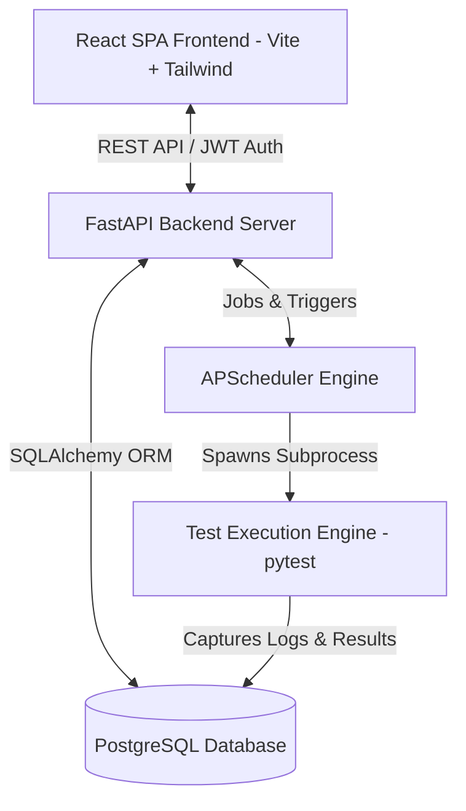

# Automated Test Execution Scheduler

A professional, full-stack web application designed to create, manage, schedule, manually trigger, and monitor automated test scripts, as well as view comprehensive execution logs and reports.

---

## 📌 Project Overview

**Automated Test Execution Scheduler** provides QA engineers, developers, and DevOps teams with a centralized platform for test automation management. It allows users to store automated test scripts (initially supporting `pytest`), schedule test runs at specific time intervals or cron schedules, trigger manual test executions on demand, track real-time execution status, and inspect detailed execution logs and historical reports.

---

## ✨ Planned Features

- **Test Script Management**: Create, edit, tag, and organize automated test scripts and test suites.
- **Automated Test Scheduling**: Schedule test executions at flexible intervals or cron expressions using `APScheduler`.
- **Manual Execution Triggers**: Trigger test suite execution instantly with on-demand controls.
- **Real-Time Execution Monitoring**: Monitor execution statuses (Pending, Running, Passed, Failed, Cancelled) in real time.
- **Log Management & Reporting**: Capture stdout/stderr logs, pytest execution summaries, pass/fail ratios, and historical execution trends.
- **User Authentication & RBAC**: Secure access control via JWT authentication.
- **Cloud Deployment Ready**: Optimized for seamless deployment on Render.

---

## 🛠️ Technology Stack

| Layer | Technology |
|---|---|
| **Frontend** | React, Vite, Tailwind CSS |
| **Backend** | Python, FastAPI |
| **Database** | PostgreSQL |
| **ORM** | SQLAlchemy |
| **Validation** | Pydantic |
| **Authentication** | JWT (JSON Web Tokens) |
| **Task Scheduler** | APScheduler |
| **Test Execution Engine** | Python `subprocess` (pytest integration) |
| **Deployment** | Render |
| **Version Control** | GitHub |

---

## 🏗️ Planned Architecture



1. **Frontend (SPA)**: Built with React, Vite, and Tailwind CSS, providing an intuitive dashboard for scheduler configuration, test management, live monitoring, and log inspection.
2. **Backend Server (FastAPI)**: RESTful API handling authentication, test script metadata management, schedule management, and log retrieval.
3. **Scheduler & Worker (APScheduler)**: Background scheduler managing execution jobs, triggering test tasks at configured intervals or on-demand.
4. **Execution Engine (Python Subprocess)**: Executes pytest test suites isolatedly in subprocesses and streams/collects stdout, stderr, exit codes, and timing metadata.
5. **Database (PostgreSQL)**: Persists user accounts, test suite definitions, schedule configurations, and detailed execution logs/metrics.

---

## 📂 Project Structure

```
automated-test-execution-scheduler/
├── backend/          # FastAPI backend application
├── frontend/         # React + Vite frontend application
├── tests/            # Test suites and test execution fixtures
├── docs/             # Documentation and architectural diagrams
├── scripts/          # Automation scripts and utility tools
├── .gitignore        # Git ignore rules
├── README.md         # Project documentation
└── render.yaml       # Render deployment specification
```

---

## ⚡ Quickstart - Backend Development

### Prerequisites
- Python 3.10+
- virtualenv / venv

### Setup & Run Backend

1. Navigate to backend directory:
   ```bash
   cd backend
   ```
2. Create and activate a virtual environment:
   ```bash
   python -m venv .venv
   # Windows (PowerShell):
   .venv\Scripts\Activate.ps1
   # Linux / macOS:
   source .venv/bin/activate
   ```
3. Install dependencies:
   ```bash
   pip install -r requirements.txt
   ```
4. Copy environment configuration:
   ```bash
   cp .env.example .env
   ```
5. Run FastAPI dev server:
   ```bash
   uvicorn app.main:app --reload --host 127.0.0.1 --port 8000
   ```
6. Access API Endpoints & Docs:
   - **Health Endpoint**: `http://127.0.0.1:8000/api/health`
   - **Swagger OpenAPI Docs**: `http://127.0.0.1:8000/docs`
   - **ReDoc**: `http://127.0.0.1:8000/redoc`

---

## 🚀 Development Status

- **Current Phase**: `Phase 1: Backend Foundation`
- **Completed**:
  - [x] Initial Repository & Scaffolding setup
  - [x] FastAPI application initialization & configuration
  - [x] Pydantic `BaseSettings` environment configuration
  - [x] SQLAlchemy database engine, sessionmaker & session dependency setup
  - [x] CORS middleware for React frontend integration
  - [x] Global exception handling
  - [x] `GET /api/health` check endpoint
- **Next Steps (Phase 2)**:
  1. Database schema design with SQLAlchemy (Users, TestScripts, Schedules, ExecutionLogs).
  2. Alembic migration setup.

---

## 📝 License

This project is licensed under the MIT License.

